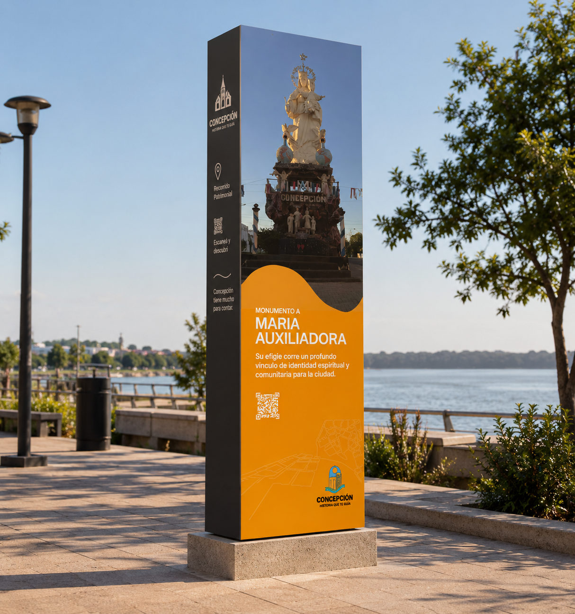
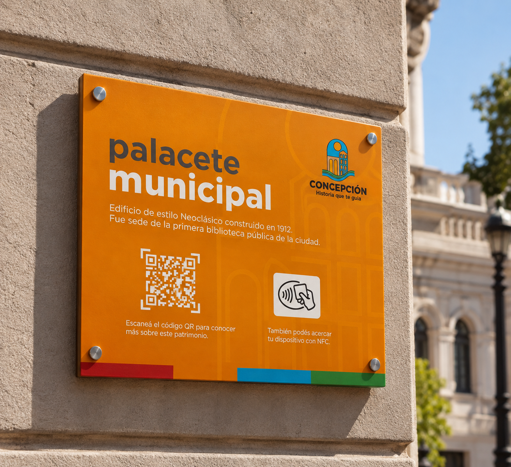
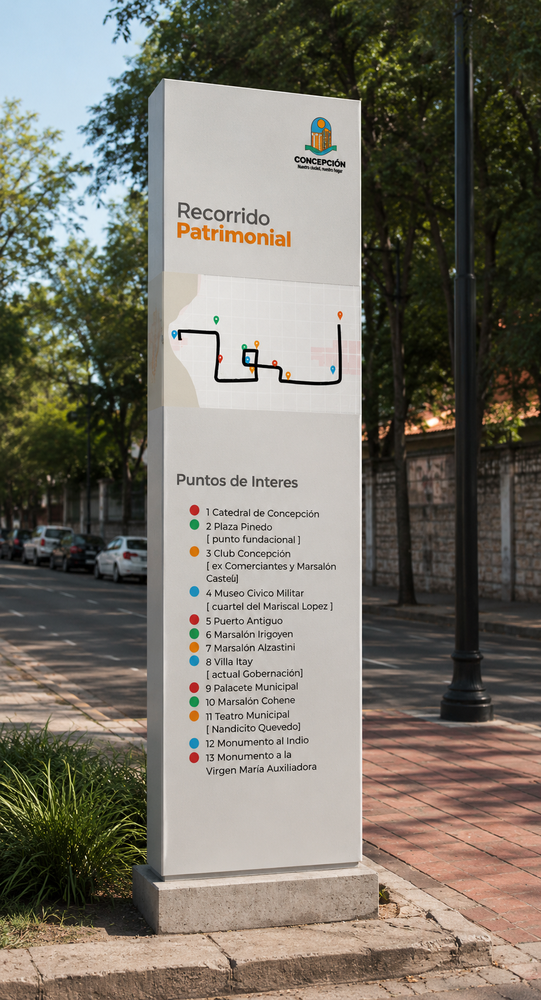

# fase 2

Despues de la entrevista que tuve con el facilitador de la Secretaria tengo algunas preocupaciones respecto al enfoque en el casco histórico porque me paso el siguiente listado de mansiones por donde hace su recorrido: 

1 Catedral de Concepción\
2 Plaza Pinedo ( punto Fundacional)\
3 Club Concepción ( ex Comandancia y Mansion Cueto)\
4 Museo Cívico Militar ( cuartel del Mariscal Lopez )\
5 Puerto Antiguo\
6 Mansion Irigoyen\
7 Mansion Albertini\
8 Villa Heyn ( actual Gobernacion)\
9 Palacete Municipal\
10 Mansión Otaño\
11 Teatro Municipal ( Mansión Quevedo)\
12 Monumento al Indio\
13 Monumento a la Virgen Maria Auxiliadora

y por ejemplo monumento al indio sale del casco histórico, pero es sumamente relevante, a su vez hice un recorrido caminando solo sobre la calle Presidente Franco&#x20;

<figure><figcaption></figcaption></figure>


resultado de entrevista&#x20;


guía del modulo



**Avance 3: Desarrollo y Exploración de Alternativas Gráficas**

1\. Objetivo de la exploración Explorar alternativas formales, cromáticas y simbólicas para el sistema de identidad visual y señalética del circuito turístico patrimonial de Concepción, buscando conectar la arquitectura histórica local y los elementos del imaginario popular con un lenguaje gráfico moderno y funcional.

### <mark style="color:$primary;">Actividades</mark>

<mark style="color:$primary;">**Avance 3 · Desarrollo del sistema gráfico (5 pts)**</mark>

<mark style="color:$primary;">Producto:</mark>

1. <mark style="color:$primary;">Conjunto de bocetos, maquetas o propuestas gráficas alternativas (+5).</mark>

<figure><figcaption></figcaption></figure>

<figure><figcaption></figcaption></figure>

<figure><figcaption></figcaption></figure>

1. <mark style="color:$primary;">Variación formal y conceptual entre las alternativas.</mark>
2. <mark style="color:$primary;">Relación explícita con los objetivos del proyecto.</mark>
3. <mark style="color:$primary;">Elección de ideas a evaluar (±3)</mark>
4. <mark style="color:$primary;">Registro comparativo de opciones y criterios en la bitácora.</mark>
5. <mark style="color:$primary;">Elección de la idea a desarrollar.</mark>

Entrevista&#x20;

Selección de hitos&#x20;

LOS SIETE TESOROS DE CONCEPCIÓN 

es un proyecto que se da en el marco del “Plan Maestro – Concepción Capital de la Cultura 2023”.&#x20;

<mark style="color:blue;">apuntando a la difusión del patrimonio cultural material de Concepción, con el objetivo de motivar la visita a los lugares propuestos y elegidos, y establecer una nueva ruta turística que permita a los propios concepcioneros y visitantes nacionales y extranjeros, conocer de manera sintética la riqueza patrimonial de la Capital de la Cultura del Paraguay 2023.N</mark>&#x20;
\ <mark style="color:blue;">El proyecto se desarrolló a través de la elección de 7 edificios o Patrimonios Culturales Materiales de la ciudad, de entre 33 candidaturas que fueron elegidas vía internet, y encuestas en colegios, universidades, bares y lugares de convergencia ciudadana, y que contó con la Declaración de Interés Cultural, por Resolución SNC N° 437/19, del Ministerio de Cultura.</mark>


\
Los 7 sitios y monumentos más representativos de Concepción, según la encuesta realizada desde el 01 de Abril hasta el 31 de Mayo de 2019, por la Asociación Cultural de la Villa Real son:
\
– Monumento al Indio.
\
– Monumento a María Auxiliadora.
\
– Mansión de Rosendo Carísimo / Palacio Episcopal (Obispado).
\
– Parroquia María Auxiliadora de los Padres Salesianos.
\
– Puerto Antiguo de la Villa Real.
\
– Mansión Quevedo / Teatro Municipal “Prof. Pedro Alvarenga Caballero”, y
\
– Catedral de Concepción.


La <mark style="color:yellow;">Secretaría de Relaciones Exteriores y Turismo</mark> de la Municipalidad de Concepción se encarga de potenciar y difundir esta nueva ruta turística que incluye exclusivamente a los 7 sitios más emblemáticos de la ciudad.



Bocetos&#x20;

<figure><figcaption></figcaption></figure>

## avance 4&#x20;

Comence calcando la marca y probando el uso de la misma en diferentes disposiciones

<figure><figcaption></figcaption></figure>


{% column width="41.66666666666667%" %}
<figure><figcaption></figcaption></figure>


{% column width="58.33333333333333%" %}




<figure><figcaption></figcaption></figure>

<figure><figcaption></figcaption></figure>

<figure><figcaption></figcaption></figure>
