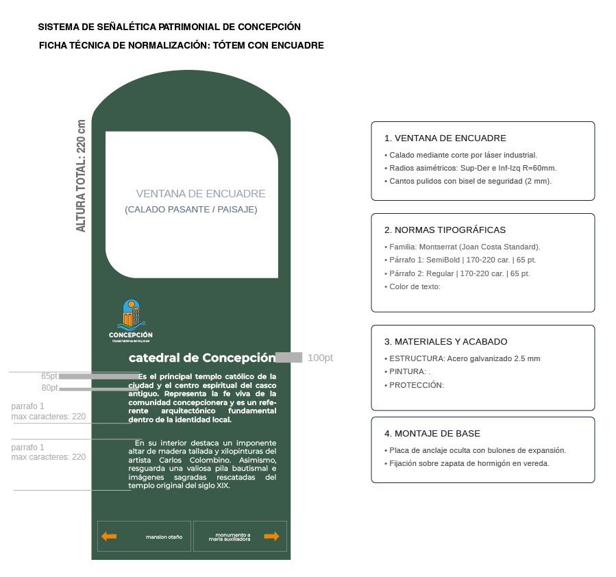

# fase 3

prepare estos archivos para ajustar detalles como el color y la disposición de los elementos&#x20;

<figure><figcaption></figcaption></figure>

> correcciones 15/09&#x20;
>
> bibliografía: señaletica joan costa&#x20;
>
> normalizar en base al texto mas largo un promedio de líneas maximo: cuerpo de texto min y max
>
> elegir tipografía
>
> parrafo justificado con sangria&#x20;
>
> ¿que se va a ver primero?&#x20;
>
> margenes iguales.&#x20;
>
> Definir si llevara nombres originales o actuales&#x20;
>
>

framing idea&#x20;

<figure><figcaption></figcaption></figure>

Nombres: originales o <mark style="color:yellow;">actuales</mark>&#x20;


Criterio de Joan Costa para señalética exterior: legibilidad a distancia, buena distinción entre caracteres (evitar confusión I/l/1), y que resista bien en cuerpos chicos si el soporte lo exige.


## &#x20;una ventana de encuadre (calado pasante)

<figure><figcaption>
margenes
</figcaption></figure>

Tipografía seleccionada: Monserrat&#x20;

<mark style="color:$warning;">HITO 01 — Catedral de Concepción</mark>

Párrafo 1: Es el principal templo católico de la ciudad y el centro espiritual del casco antiguo. Representa la fe viva de la comunidad concepcionera y es un referente arquitectónico fundamental dentro de la identidad local.

Caracteres: 213/220

Párrafo 2: En su interior destaca un imponente altar de madera tallada y xilopinturas del artista Carlos Colombino. Asimismo, resguarda una valiosa pila bautismal e imágenes sagradas rescatadas del templo original del siglo XIX.

Caracteres: 217/220

TOTAL: 430/440 caracteres

INFORMACIÓN FALTANTE: Ninguna.

<mark style="color:$warning;">HITO 02 — Plaza Pinedo (Punto Fundacional)</mark>

Párrafo 1: Es el espacio público verde original alrededor del cual se fundó la Villa Real de la Concepción en 1773. Representa el origen urbano y el hito histórico que dio inicio a la ocupación territorial del norte paraguayo.

Caracteres: 215/220

Párrafo 2: Hoy en día conserva su trazado tradicional, arbolado nativo y monumentos conmemorativos.&#x20;

Caracteres: <mark style="color:$primary;">x</mark>

TOTAL: <mark style="color:$primary;">x</mark> caracteres

INFORMACIÓN FALTANTE: Ninguna.

<mark style="color:$warning;">HITO 03 — Club Concepción</mark>&#x20;

Párrafo 1: Es una de las sedes sociales más antiguas de la región, ubicada en una señorial casona histórica. Representa la evolución urbana local, al haber cambiado su función de antigua comandancia militar a centro social.

Caracteres: 212/220

Párrafo 2: Su arquitectura deslumbra por la fachada neoclásica con amplias galerías y elegantes columnas. Perteneció a la familia Cueto y fue escenario de los bailes de gala más distinguidos durante la época del auge fluvial.

Caracteres: 214/220

TOTAL: 426/440 caracteres

INFORMACIÓN FALTANTE: Horarios de acceso o visitas guiadas al interior para turistas civiles.

<mark style="color:$warning;">HITO 04 — Museo Cívico Militar (Cuartel del Mcal. López)</mark>

Párrafo 1: Es un céntrico recinto militar del siglo XIX convertido en espacio museológico. Representa el pasado defensivo del norte paraguayo y resguarda la memoria de quienes combatieron en las contiendas patrias.

Caracteres: 203/220

Párrafo 2: Mantiene su arquitectura colonial con galerías corridas y paredes de adobe. El visitante puede observar uniformes, armas históricas, fotografías de época y objetos personales usados por las tropas en combate.

Caracteres: 208/220

TOTAL: 411/440 caracteres

INFORMACIÓN FALTANTE: Horarios de atención actualizados del museo.

<mark style="color:$warning;">HITO 05 — Puerto Antiguo</mark>

Párrafo 1: Es el área embarcadero histórica sobre el río Paraguay que impulsó la expansión económica del norte. Representa la época dorada del comercio fluvial y la apertura cosmopolita de la ciudad al mundo entero.

Caracteres: 204/220

Párrafo 2: Fue la principal vía de exportación de yerba mate, maderas nobles y carne. El visitante puede contemplar vestigios de viejas grúas de desembarco, galpones portuarios y atardeceres deslumbrantes junto al río.

Caracteres: 207/220

TOTAL: 411/440 caracteres

INFORMACIÓN FALTANTE: Ninguna.

<mark style="color:$warning;">HITO 06 — Mansión Irigoyen</mark>

Párrafo 1: Es una de las residencias señoriales privadas más imponentes del casco histórico. Representa el poderío económico de las familias comerciantes que prosperaron durante la gran bonanza fluvial de inicios del siglo XX.

Caracteres: 215/220

Párrafo 2: Su diseño se distingue por balcones de hierro forjado traídos directamente de Europa y techos elevados. Desde la vereda el visitante puede admirar la fina carpintería original y los detalles ornamentales de la fachada.

Caracteres: 218/220

TOTAL: 433/440 caracteres

INFORMACIÓN FALTANTE: Verificar la condición actual de la propiedad y si cuenta con permisos de acceso interior.

<mark style="color:$warning;">HITO 07 — Mansión Albertini</mark>

Párrafo 1: Es una destacada casona neoclásica levantada a comienzos del siglo XX. Representa la importante influencia cultural y económica de los inmigrantes italianos que se asentaron en la ciudad durante su época dorada.

Caracteres: 211/220

Párrafo 2: Muestra una fachada simétrica con pilastras labradas, finas molduras de mampostería y amplios ventanales. Su diseño bioclimático fue concebido para favorecer la ventilación cruzada frente al clima norteño.

Caracteres: 205/220

TOTAL: 416/440 caracteres

INFORMACIÓN FALTANTE: Verificar el uso actual del inmueble y los límites de acceso privado.

<mark style="color:$warning;">HITO 08 —  Gobernación</mark>

Párrafo 1: Es una de las edificaciones de estilo ecléctico más deslumbrantes de la ciudad. Antiguamente residencia privada de la familia Heyn, hoy representa el centro administrativo y político del gobierno departamental.

Caracteres: 210/220

Párrafo 2: Destaca por su singular torre de esquina, amplias terrazas y refinada mampostería ornamental. El Estado paraguayo adquirió la palaciega casona para restaurarla y ponerla al servicio de la administración pública.

Caracteres: 211/220

TOTAL: 421/440 caracteres

INFORMACIÓN FALTANTE: Horarios institucionales habilitados para recorridos turísticos en patios y áreas comunes.

<mark style="color:$warning;">HITO 09 — Palacete Municipal</mark>

Párrafo 1: Es la sede oficial del gobierno municipal concepcionero y un referente cívico clave en el centro urbano. Representa la consolidación de las instituciones públicas y la organización administrativa local moderna.

Caracteres: 210/220

Párrafo 2: Fue construido a mediados del siglo XX con un diseño sobrio de estilo institucional, arcadas frontales y balcones solemnes. En sus salones se conservan valiosos registros documentales de la historia municipal.

Caracteres: 209/220

TOTAL: 419/440 caracteres

INFORMACIÓN FALTANTE: Ninguna.

<mark style="color:$warning;">HITO 10 — Mansión Otaño</mark>

Párrafo 1: Es una de las villas señoriales mejor conservadas del patrimonio edificado de la ciudad. Representa el esplendor social y la prosperidad alcanzada por las familias vinculadas a la gran producción yerbatera.

Caracteres: 206/220

Párrafo 2: Fue construida a comienzos del siglo XX por la acaudalada familia Otaño. Resalta por sus amplias galerías perimetrales, finos detalles de carpintería y un jardín interior pensado para refrescar la residencia.

Caracteres: 208/220

TOTAL: 414/440 caracteres

INFORMACIÓN FALTANTE: Confirmar el uso funcional contemporáneo del edificio.

<mark style="color:$warning;">HITO 11 — Teatro Municipal</mark>&#x20;

Párrafo 1: Es el espacio cultural y escénico más relevante de la ciudad. Representa la recuperación del patrimonio edificado para uso público y el florecimiento de la actividad artística contemporánea de Concepción.

Caracteres: 204/220

Párrafo 2: Fue la residencia particular de la familia Quevedo antes de ser adaptada por el municipio. Presenta una refinada fachada neoclásica y salas acondicionadas para obras teatrales, conciertos e intercambios sociales.

Caracteres: 212/220

TOTAL: 416/440 caracteres

INFORMACIÓN FALTANTE: Disponibilidad de agenda de eventos culturales para visitantes.

<mark style="color:$warning;">HITO 12 — Monumento a la Virgen María Auxiliadora</mark>

Párrafo 1: Es un relevante hito devocional y paisajístico situado en una elevación ribereña. Representa la fe protectora de la comunidad hacia los navegantes del río Paraguay y la influencia salesiana en la región.

Caracteres: 203/220

Párrafo 2: La escultura se eleva sobre un pedestal rodeado de senderos y jardines. Es el punto culmen de las tradicionales procesiones náuticas de mayo y un mirador idóneo para contemplar las aguas del río Paraguay.

Caracteres: 204/220

TOTAL: 407/440 caracteres

INFORMACIÓN FALTANTE: Ninguna.

<figure><figcaption></figcaption></figure>

