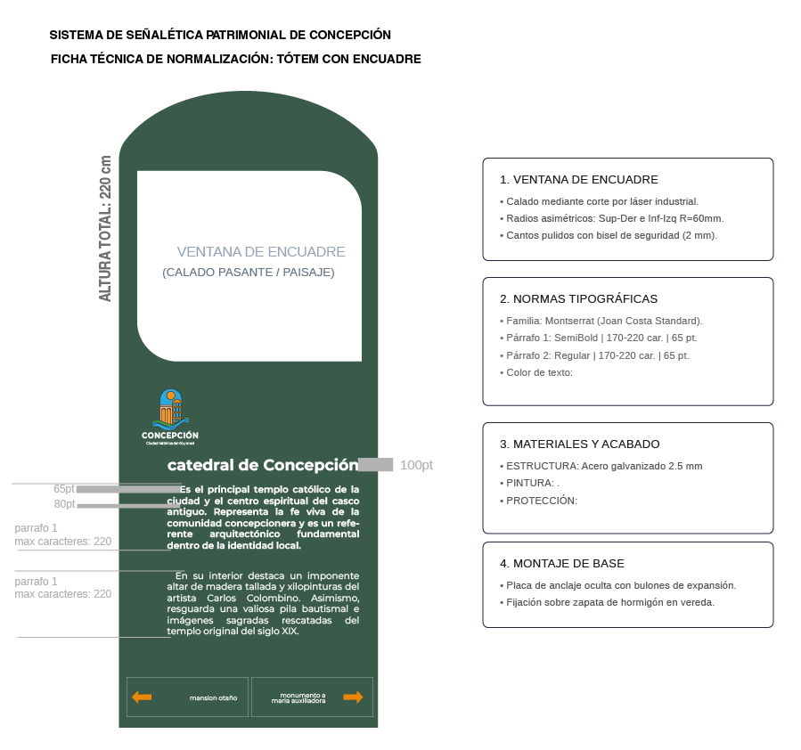

# fase 3

prepare estos archivos para ajustar detalles como el color y la disposición de los elementos&#x20;

<figure><figcaption></figcaption></figure>

> correcciones 15/09&#x20;
>
> bibliografía: señaletica joan costa&#x20;
>
> normalizar en base al texto mas largo un promedio de líneas maximo: cuerpo de texto min y max
>
> elegir tipografía
>
> parrafo justificado con sangria&#x20;
>
> ¿que se va a ver primero?&#x20;
>
> margenes iguales.&#x20;
>
> Definir si llevara nombres originales o actuales&#x20;
>
>

framing idea&#x20;

<figure><figcaption></figcaption></figure>

Nombres: originales o <mark style="color:yellow;">actuales</mark>&#x20;


Criterio de Joan Costa para señalética exterior: legibilidad a distancia, buena distinción entre caracteres (evitar confusión I/l/1), y que resista bien en cuerpos chicos si el soporte lo exige.


## &#x20;una ventana de encuadre (calado pasante)

pruebas&#x20;

<figure><figcaption>
margenes
</figcaption></figure>

Tipografía seleccionada: Monserrat&#x20;

<figure><figcaption></figcaption></figure>

